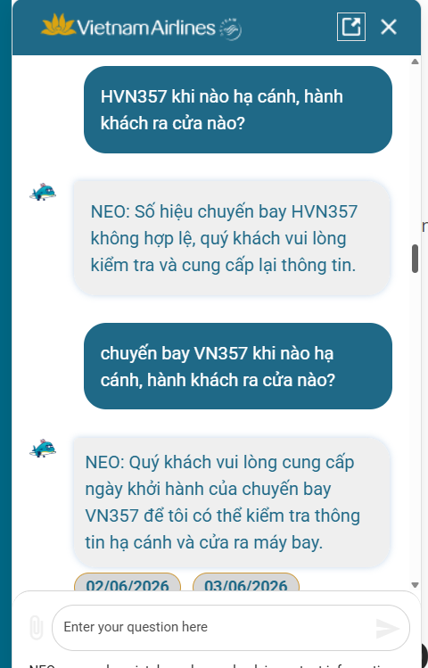
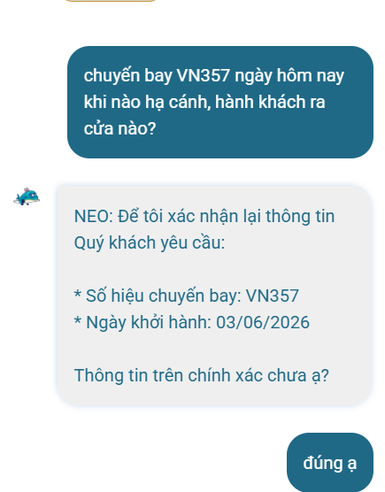
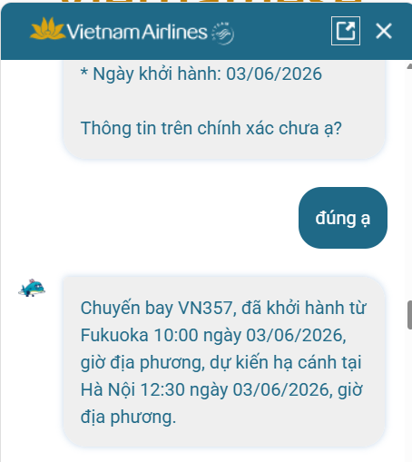
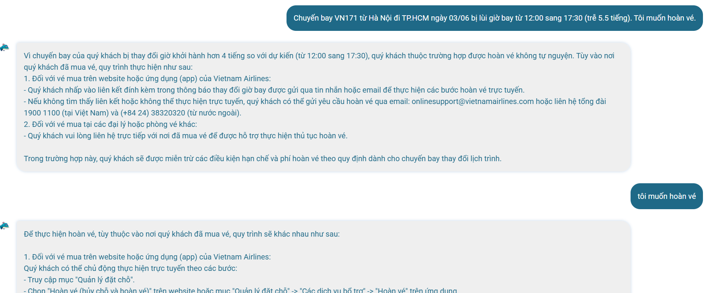
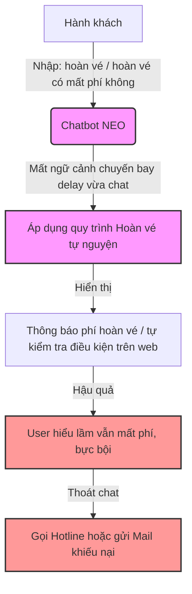
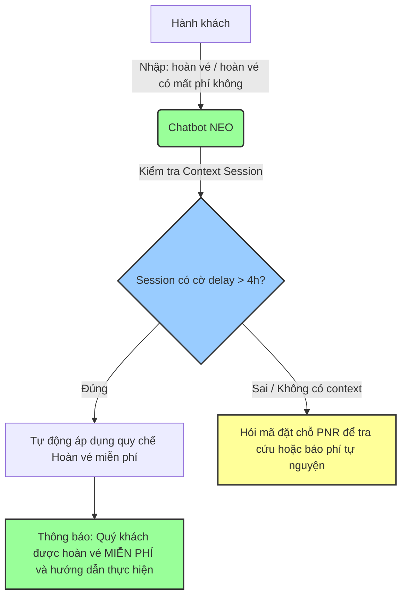

# Workshop — Mổ App AI Thật

**Thời gian:** 35-45 phút  
**Hình thức:** cá nhân trước, chia sẻ theo nhóm sau  
**Output:** finding note + sketch `as-is / to-be`

Mục tiêu không phải chấm "UI đẹp hay xấu". Mục tiêu là dùng sản phẩm thật như một bài needfinding: tìm chỗ product gãy trong workflow thật, rồi viết finding đó thành quyết định product.

## 1. Chọn một sản phẩm để dùng thử

| Sản phẩm | AI feature | Cách truy cập |
|---|---|---|
| MoMo — Moni | Trợ thủ tài chính, phân tích chi tiêu, chatbot | App MoMo |
| **Vietnam Airlines — NEO** | **Chatbot hỗ trợ vé, hành lý, khiếu nại** | **Website/Zalo VNA** |
| V-App — V-AI | Trợ lý voice/text, gợi ý theo ngữ cảnh | App V-App |

*(Sản phẩm đã chọn: **Vietnam Airlines — NEO**)*

## 2. Dùng thử: promise vs reality

**Ghi nhanh:**

- **Product hứa gì?** Hỗ trợ hành khách giải đáp thắc mắc 24/7 về lịch bay, hành lý, quy định bay và thực hiện đổi/hoàn vé tự động để giảm tải cho bộ phận tổng đài chăm sóc khách hàng.
- **User nào được hứa sẽ được giúp?** Hành khách đi máy bay của Vietnam Airlines cần tra cứu nhanh thông tin hoặc thay đổi đặt chỗ chủ động.
- **Bạn kỳ vọng AI làm được task nào?**
  1. Nhận diện được mã chuyến bay chuẩn hàng không (cả mã IATA như VN357 và mã ICAO như HVN357).
  2. Trả lời đầy đủ tất cả các ý trong một câu hỏi kép (ví dụ: giờ hạ cánh + cửa ra máy bay).
  3. Duy trì ngữ cảnh hội thoại để áp dụng đúng chính sách hoàn vé miễn phí cho chuyến bay bị delay > 4 tiếng khi người dùng hỏi tiếp các câu liên quan ở phần sau.
- **Khi dùng thật, điểm gãy xuất hiện ở đâu?**
  1. **Lỗi định dạng chuyến bay:** Không nhận diện được mã chuyến bay "HVN357" (mã ICAO chính thức của hãng), báo lỗi số hiệu không hợp lệ.
  2. **Bỏ sót thông tin:** Khi nhận câu hỏi kép (giờ hạ cánh + cửa ra), chatbot chỉ trả lời giờ hạ cánh và hoàn toàn bỏ quên thông tin cửa ra.
  3. **Mất ngữ cảnh (Context Loss) & Áp sai phí:** Sau khi bot đã xác nhận chuyến bay VN171 bị trễ 5.5 tiếng thuộc diện được hoàn vé miễn phí, khách hỏi tiếp "tôi muốn hoàn vé" hoặc "hoàn vé có mất phí không" (có typo), bot mất sạch ngữ cảnh trước đó, đưa ra câu trả lời mặc định là hoàn vé có thể mất phí và bắt người dùng tự tra cứu.

**Evidence cụ thể (Observation trích từ hội thoại thực tế):**

- **Hội thoại thực tế quan sát được:**
  ```text
  Khách: "HVN357 khi nào hạ cánh, hành khách ra cửa nào?"
  NEO: "Số hiệu chuyến bay HVN357 không hợp lệ, quý khách vui lòng kiểm tra và cung cấp lại thông tin."
  ```
  
  ```text
  Khách: "chuyến bay VN357 ngày hôm nay khi nào hạ cánh, hành khách ra cửa nào?"
  NEO: "Để tôi xác nhận lại thông tin Quý khách yêu cầu:
  * Số hiệu chuyến bay: VN357
  * Ngày khởi hành: 03/06/2026
  Thông tin trên chính xác chưa ạ?"
  Khách: "đúng ạ"
  NEO: "Chuyến bay VN357, đã khởi hành từ Fukuoka 10:00 ngày 03/06/2026, giờ địa phương, dự kiến hạ cánh tại Hà Nội 12:30 ngày 03/06/2026, giờ địa phương." (Bỏ sót hoàn toàn thông tin cửa ra máy bay).
  ```
    
  ```text
  Khách: "Chuyến bay VN171 từ Hà Nội đi TP.HCM ngày 03/06 bị lùi giờ bay từ 12:00 sang 17:30 (trễ 5.5 tiếng). Tôi muốn hoàn vé."
  NEO: "Vì chuyến bay của quý khách bị thay đổi giờ khởi hành hơn 4 tiếng... quý khách thuộc trường hợp được hoàn vé không tự nguyện... được miễn trừ các điều kiện hạn chế và phí hoàn vé..."
  Khách: "tôi muốn hoàn vé"
  NEO: "Để thực hiện hoàn vé... truy cập mục Quản lý đặt chỗ... phí hoàn vé áp dụng..."
  Khách: "hoàn vé có mất phí không"
  NEO: "Việc hoàn vé có thể phát sinh phí, tùy thuộc vào loại vé..." (Mất hoàn toàn ngữ cảnh chuyến bay bị delay 5.5 tiếng đã xác nhận ở tin nhắn trước).
  ```
    


- **Hành vi lỗi:** 
  1. Không có bộ chuẩn hóa dữ liệu đầu vào (data normalizer) để quy đổi mã ICAO (HVN) về IATA (VN).
  2. Parser/LLM Generator không kiểm tra tính đầy đủ của câu trả lời so với các thực thể (entities) được hỏi trong câu hỏi kép.
  3. State management của chatbot không giữ được trạng thái "giao dịch bị ảnh hưởng do delay" trong phiên hội thoại (session context), dẫn đến việc quay lại luồng tư vấn chung chung có tính phí.

## 3. Vẽ 4 paths

| Path | Trạng thái trong sản phẩm hiện tại | Mô tả chi tiết |
|---|---|---|
| **Happy** | Đã có | Khách hỏi: *"Hành lý ký gửi hạng Phổ thông được bao nhiêu kg?"* -> AI phản hồi chính xác ngay lập tức: *"Hạng Phổ thông tiêu chuẩn được 1 kiện 23kg..."* |
| **Low-confidence** | Đã có một phần | Khách hỏi "VN357 khi nào hạ cánh", AI chưa biết ngày nên hiển thị các nút chọn ngày (02/06, 03/06, 04/06) để xác nhận trước khi truy vấn thông tin chính xác. |
| **Failure** | Đã có (Điểm gãy) | 1. Khách nhập mã chuyến bay ICAO "HVN357" -> AI báo lỗi không hợp lệ.<br>2. Khách hỏi kép (hạ cánh + cửa ra) -> AI trả lời thiếu thông tin cửa ra.<br>3. Khách hỏi tiếp về phí hoàn vé sau khi vừa xác nhận chuyến bay bị delay -> AI quên ngữ cảnh và báo hoàn vé mất phí. |
| **Correction** | Chưa có | Khách nhập typo "hoàn vé" -> AI vẫn nhận diện được ý hoàn vé nhưng không thể đính chính thông tin đã xác nhận ở trên ("Hãng delay 5.5 tiếng tôi đã nói ở trên mà") để đưa ra kết luận hoàn tiền miễn phí, mà lặp lại hướng dẫn tính phí. |

## 4. Viết finding thành quyết định

```text
Khi user hỏi các câu hỏi tiếp nối hoặc hỏi về phí sau khi vừa xác nhận chuyến bay bị delay > 4 tiếng,
AI/product mất ngữ cảnh hội thoại cũ (Context/Session Loss),
hậu quả là tư vấn sai chính sách (báo có phí thay vì miễn phí), gây bối rối cho hành khách và làm mất uy tín dịch vụ chăm sóc khách hàng.
Lỗi thuộc layer UX Recovery + State Management (không duy trì biến ngữ cảnh "involuntary_refund_eligible" trong suốt session).
Nên sửa bằng cách:
1. Thêm State Management: Lưu trữ trạng thái "Chuyến bay delay > 4 tiếng" của session hiện tại. Nếu cờ này là True, bất kỳ câu hỏi nào về "phí hoàn/đổi vé" sau đó đều phải tự động áp dụng quy tắc miễn phí.
2. Cập nhật SPEC: Định nghĩa thêm rule chuẩn hóa mã chuyến bay (HVN -> VN) và yêu cầu kiểm tra tính đầy đủ (Coverage check) đối với các câu hỏi kép trước khi sinh câu trả lời.
```

## 5. Sketch as-is / to-be

### Flow As-Is (Hiện tại - Điểm gãy)


### Flow To-Be (Đề xuất - Sửa đổi)


## 6. Tự kiểm trước khi nộp

- [x] Có ít nhất 1 screenshot hoặc observation cụ thể. (Xem phần 2 - Observation hội thoại)
- [x] Có đủ 4 paths hoặc nói rõ path nào chưa có trong product. (Xem bảng phần 3)
- [x] Finding được viết thành product decision, không chỉ là nhận xét. (Xem phần 4)
- [x] Sketch có as-is và to-be. (Xem sơ đồ Mermaid phần 5)
- [x] Có một câu nói rõ finding này sẽ đổi gì trong SPEC.

**Thay đổi cụ thể trong SPEC:**
Finding này sẽ bổ sung vào SPEC yêu cầu: 
 (1) Thiết lập module State Management cho session chat để duy trì cờ "involuntary_refund_eligible" khi đã xác thực chuyến bay delay; 
 (2) Thêm rule chuẩn hóa mã chuyến bay (ICAO -> IATA); 
 (3) Thêm tiêu chí kiểm tra độ phủ câu trả lời (coverage check) đối với câu hỏi kép.
